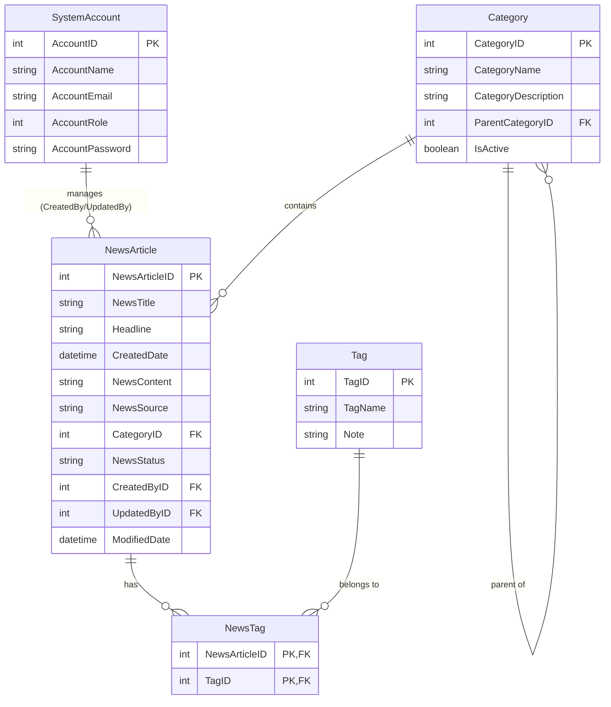

# PRN222 Assignment 01: Building a News Management System
**Platform:** ASP.NET Core Web App (Model-View-Controller)

---

## 1. Introduction
A News Management System (NMS) is a software application that helps universities and educational institutions efficiently manage, organize, and publish news and content to their website and other channels. The NMS typically includes features such as content creation, approval workflow, scheduling, publishing, and analytics. This can help universities to arrange appropriately their news operations, improve communication with students and the wider community, and better engage with their target audience.

Imagine you're a developer of a News Management System named **FUNewsManagementSystem**. To implement a part of this system your tasks include: 
- Manage account information. 
- Manage news article. 

> **Note:** The application has a default account (admin account) whose email is `admin@FUNewsManagementSystem.org` and password is `@@abc123@@` that stored in the `appsettings.json`.

---

## 2. Assignment Objectives
In this assignment, you will:
- Use Visual Studio .NET to create ASP.NET Core MVC and Class Library (.dll) projects.
- Perform CRUD actions using **Entity Framework Core**.
- Use **LINQ** to query and sort data.
- Apply **3-Layers architecture** to develop the website.
- Apply **Repository pattern** and **Singleton pattern** in a project.
- Add CRUD and searching actions to the website.
- Apply validation data type for all fields.
- Run the project and test the Web application actions.

---

## 3. Database Design

### Database Notes:
- A news article will belong to only **one** news category (`Category`). 
- An account with staff’s role can create **many** news articles in this system. *(Staff role = 1, Lecturer role = 2; Admin role will get from `appsettings.json` file)*.
- A news article will have **many** tags and one tag will belong to **zero or one** news article. *(News status = active(1) / inactive(0))*. 
- Category status = active(1) / inactive(0).

---

## 4. Main Functions
- Do **not** need authentication to view the news article (news status must be active) in this system.
- Member (Admin/Staff/Lecturer) authentication by **Email** and **Password**. 
- If user is a **“Lecturer”**, this role is allowed to view the news article (news status must be active) in this system.
- If the user is an **“Admin”**, this admin role is allowed to:
  - Manage account information.
  - Create a report statistic by the period from `StartDate` to `EndDate` (it depends to the news’ created date), and sort data in descending order.
- If user is a **“Staff”**, this staff role is allowed to:
  - Manage category information. *(The delete action will delete an item in the case this item is not belong to any news articles. If the item is already stored in a news article cannot delete.)*
  - Manage news article (includes tags). 
  - Manage his/her profile.
  - View news history created by him/her.

> **Important Note:** News article Management, Account Management, and Category Management require: **Read, Create, Update, Delete and Search** actions. Creating and Updating actions must be performed by **popup dialog**. Delete action always combines with **confirmation**.

---

## 5. Note
- You must use **Visual Studio 2019 or above** (.NET5 / .NET6 / .NET7 / .NET8), **MSSQL Server 2012 or above** for your development tools.  
- To do your program, you must use **ASP.NET Core Web App (Model-View-Controller)**. Note that you are not allow to connect direct to database from Controller, every database connection must be used through Service, Repository and Data Access Objects. The database connection string must get from `appsettings.json` file.
- Create Solution in Visual Studio named `StudentName_ClassCode_A01.sln`. Inside your Solution, the Project Web App must be named: `StudentNameMVC`.
- Create your MS SQL database named `FUNewsManagement` by running code in script `FUNewsManagement.sql`. 
- Set the default user interface for your project as **Login window**.
